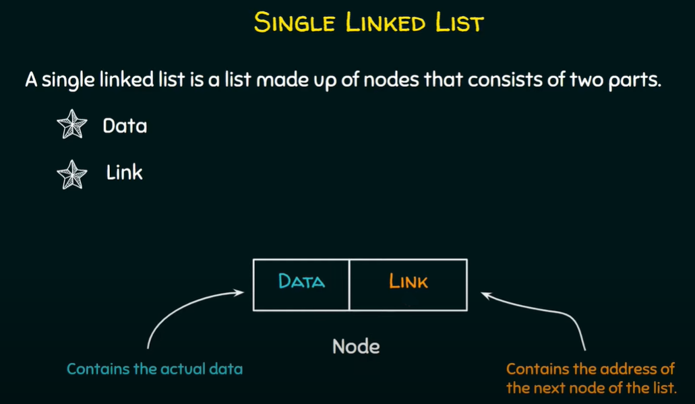

## Linked Lists

A Linked List is a list of elements called nodes that are connected together or linked together in a single file-line. In simple words, a linked list consists of nodes where each node contains a data field and a reference(link) to the next node in the list.


There are several types of linked lists:
* Singly linked list
* Doubly linked list
* Circular linked list

In a **singly linked list**, each node only has reference to the node after it or the next node.



In a **doubly linked list**, each node has a reference to the next node but it also has a reference to the one before it or the previous node.

In a **circular linked list**, the last element is linked to the first element.

The linked list itself as a whole only needs to know about two nodes in the whole list for it to function correctly.

It needs to know about the head node and the tail node and it keeps a reference to these nodes by two pointers which are rightfully called the **head pointer** and the **tail pointer**.

### Adding to head

```javascript
function LinkedList() {
    this.head = null;
    this.tail = null;
}

function Node(value, next, prev) {
    this.value = value;
    this.next = next;
    this.prev = prev;
}

LinkedList.prototype.addToHead = function (value) {
    let newNode = new Node(value, this.head, null);
    if (this.head) {
        this.head.prev = newNode
    }
    else {
        this.tail = newNode
    }
    this.head = newNode;
}

let ll = new LinkedList();

ll.addToHead(100);
ll.addToHead(200);
ll.addToHead(300);
```