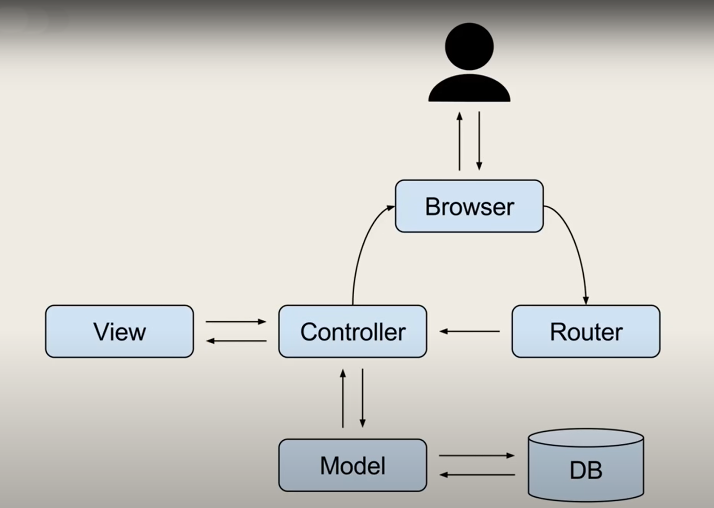
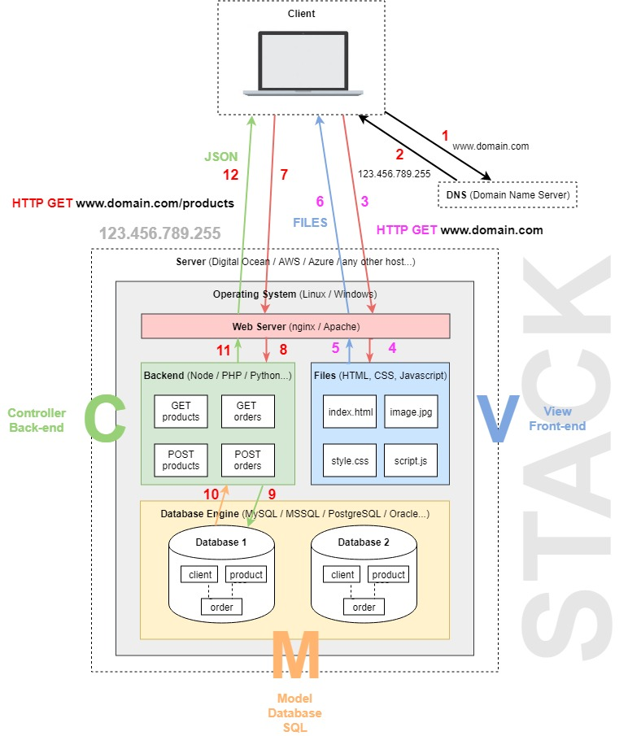

### MVC - Model View Controller

MVC is a software architecture - the structure of the system - that separates domain/application/business (whatever you prefer) logic from the rest of the user interface. It does this by separating the application into three parts: the model, the view, and the controller.

Summary:

* Software Architectural Design Pattern

* Frequently Used

* Separates application functionality

* Promotes organized programming

---
#### Model

The Model handles the state of the application. The state is what your application is about. If your application is a forum, your Model might contain Class::DBI objects representing threads, users and postings. The Model does not know anything about HTML, or web servers or anything like that. It just supplies ways to query the state, and ways to change that state.

Summary: 

* Data related logic

* Interactions with database(SELECT, INSERT, UPDATE, DELETE)

* Communicates with controller

* Can sometimes update the view (Depends on the framework)

#### View

The View is the representation of the user interface. Usually there are many (possibly nested) Views in a single application. A view can query the model, but it is not supposed to change the state. In web based MVC systems, a view can be implemented using a template that renders an HTML page. In our hypothetical forum application, the Views would be the templates for rendering a full thread, the login page, the posting page etc.

Summary: 

* What the end user sees (UI)

* Usually consists of HTML/CSS

* Communicates with the controller

* Can be passed dynamic values from the controller

* Template Engines (ejs, hbs, jade etc...)

#### Controller

User actions on the View are send to the Controller. In a web environment, this is usually done by having the Controller handle the incoming HTTP requests.

The Controller receives user requests, and translates them into actions that the Model should take. Then it selects the appropriate View to handle the response.

Summary: 

* Receives input (from view, url)

* Processes requests (GET, POST, PUT, DELETE)

* Gets data from the model

* Passes data to the view

The user sees the view of the app in the browers.

It makes some kind of request with input to the Router. The request could be some kind of link that the user clicked on, some kind of route.

The Router calls a specific controller method based on that route and if data is needed, the controller will then interract with the model, which in turn interacts with the Database.

Once the controller gets that data passed back, it can then load a view and it can send a data to the view and it will get dealt with by the template engine.

Once all that is done, it will send the view back go the browser for the user to see.

