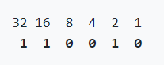

## Lecture 0 - Starting from scratch

### What is computer science?
---
* Computer science is fundamentally problem solving.

* We can think of problem solving as the process of taking some input (details about our problem) and generate some output (the solution to our problem).

### Representing numbers
---
* **Unary** - We might start with the task of taking attendance by counting the number of people in a room. With our hand, we might raise one finger at a time to represent each person, but we won’t be able to count very high. This system is called unary, where each digit represents a single value of one.

* **Decimal** - We’ve probably learned a more efficient system to represent numbers, where we have ten digits, 0 through 9. This system is called decimal, or base 10, since there are ten different values that a digit can represent.

* **Binary** - Computers use a simpler system called **binary**, or base two, with only two possible digits, 0 and 1. Each binary digit is also called a **bit**.

Since computers run on electricity, which can be turned on or off, we can conveniently represent a bit by turning some switch on or off to represent a 0 or 1.

* **Transistors** - Inside modern computers, there are not light bulbs but million of tiny switches called transistors that can be turned on and off to represent different values.

In binary, with just two digits, we have powers of two for each place value:

22 21 20

For example:  

20 = 1  
21 = 2  
22 = 4  

And so on...in the end, we add up the numbers above the 1s, in the example above, we add 32 + 16 + 2 = 50.

