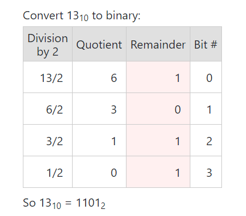
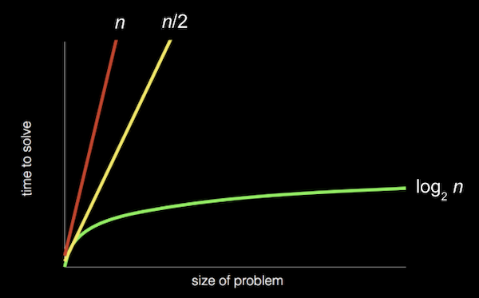

## Lecture 0 - Starting from scratch

### What is computer science?

* Computer science is fundamentally problem solving.

* We can think of problem solving as the process of taking some input (details about our problem) and generate some output (the solution to our problem).
---
### Representing numbers

* **Unary** - We might start with the task of taking attendance by counting the number of people in a room. With our hand, we might raise one finger at a time to represent each person, but we won’t be able to count very high. This system is called unary, where each digit represents a single value of one.

* **Decimal** - We’ve probably learned a more efficient system to represent numbers, where we have ten digits, 0 through 9. This system is called decimal, or base 10, since there are ten different values that a digit can represent.

* **Binary** - Computers use a simpler system called **binary**, or base two, with only two possible digits, 0 and 1. Each binary digit is also called a **bit**.

Since computers run on electricity, which can be turned on or off, we can conveniently represent a bit by turning some switch on or off to represent a 0 or 1.

* **Transistors** - Inside modern computers, there are not light bulbs but million of tiny switches called transistors that can be turned on and off to represent different values.

In binary, with just two digits, we have powers of two for each place value:

22 21 20

For example:  
 
   
20 = 1  
21 = 2  
22 = 4  

And so on...in the end, we add up the numbers above the 1s, in the example above, we add 32 + 16 + 2 = 50.

* **Converting decimal to binary:**  
1. Divide the number by 2.
2. Get the integer quotient for the next iteration.
3. Get the remainder for the binary digit.
4. Repeat the steps until the quotient is equal to 0.

Let's take the number 60, for example:  
60 / 2 = 30 --> the quotient is 30, remainder 0  
30 / 2 = 15 --> the quotient is 15, remainder 0  
15 / 2 = 7 --> the quotient is 7, remainder 1  
7 / 2 = 3 --> the quotient is 3, remainder 1   
3 / 2 = 1 --> the quotient is 1, remainder 1  
1 / 2 = 0 --> the quotient is now 0, remainder 1

So the number 60 converted to binary is 11100.

---
### Text
* To represent letters, all we need to do is decide how numbers map to letters. We assign numbers to characters which is known as character encoding.

* **ASCII** - The standard mapping, American Standard Code for Information Interchange(ASCII), also includes lowercase letters and punctuation.

* If we received a text message with a pattern of bits that had the decimal values 72, 73, and 33, those bits would map to the letters `HI!`. Each letter is typically represented with a pattern of eight bits, or a byte, so the sequences of bits we would receive are `01001000`, `01001001`, and `00100001`.

* We are already familiar with using bytes as a unit of measurement for data, as in megabytes or gigabytes, for millions or billions of bytes.

* With eight bits, or one byte, we can have 28, or 256 different values (including zero). (The highest value we can count up to would be 255.)

* **Unicode** - Other characters, such as letters with accent marks and symbols in other languages, are part of a standard called Unicode, which uses more bits than ASCII to accommodate all these characters.

* When we receive an emoji, our computer is actually just receiving a number in binary that it then maps to the image of the emoji based on the Unicode standard.

For example, the “face with tears of joy” emoji is just the bits `000000011111011000000010`:

---
### Images, video, sounds

* An image, like the picture of the emoji, are made up of colors.

* **RGB** - With only bits, we can map numbers to colors as well. There are many different systems to represent colors, but a common one is RGB, which represents different colors by indicating the amount of red, green, and blue within each color.

* For example, our pattern of bits earlier, 72, 73, and 33 might indicate the amount of red, green, and blue in a color. (And our programs would know those bits map to a color if we opened an image file, as opposed to receiving them in a text message.)

* Each number might be a byte, with 256 possible values, so with three bytes, we can represent millions of colors.

* The dots, or squares, on our screens are called **pixels**, and images are made up of many thousands or millions of those pixels as well. So by using three bytes to represent the color for each pixel, we can create images.

* The resolution of an image is the number of pixels there are, horizontally and vertically, so a high-resolution image will have more pixels and require more bytes to be stored.

* Videos are made up of many images, changing multiple times a second to give us the appearance of motion, as an old-fashioned flipbook might do.

* Music can be represented with bits, too, with mappings of numbers to notes and durations, or more complex mappings of bits to sound frequencies at each moment of time.

* File formats, like JPEG and PNG, or Word or Excel documents, are also based on some standard that some humans have agreed on, for representing information with bits.

---
### Algorithms

* **Algorithm** -  a finite sequence of well-defined, computer-implementable instructions, typically to solve a class of problems or to perform a computation. It's basically a series of  step-by-step instructions for solving problems.

In fact, we can represent the efficiency of each of those algorithms with a chart:

1. Our first solution, searching one page at a time, can be represented by the red line: our time to solve increases linearly as the size of the problem increases. n is a some number representing the size of the problem, so with n pages in our phone books, we have to take up to n steps to find a name.

2. The second solution, searching two pages at a time, can be represented by the yellow line: our slope is less steep, but still linear. Now, we only need (roughly) n / 2 steps, since we flip two pages at a time.

3. If the phone book went from 1000 to 2000 pages, we would only need one more step to find our name. If the size doubled again from 2000 to 4000 pages, we would still only need one more step. The green line is labeled log2 n, or log base 2 of n, since we’re dividing the problem by two with each step.