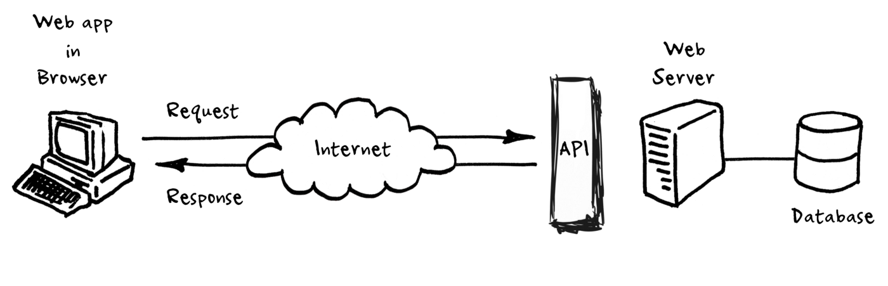

# General Stuff


## Miscellaneous
### Monorepo 

* A version-controlled code repository that holds many projects. While these projects may be related, they are often logically independent and run by different teams.

* Some companies host all their code in a single repository, shared among everyone. Monorepos can reach colossal sizes. Google, for example, is theorized to have the largest code repository ever, which has tens of hundreds of commits per day and is over 80 TBs large. Other companies known to run large monorepos are Microsoft, Facebook, and Twitter.

* Monorepos are sometimes called monolithic repositories, but they should not be confused with monolithic architecture, which is a software development practice for writing self-contained applications.


### CI/CD (Continuous Integration/Continuous Delivery and/or Continuous Deployment)

* CI/CD is a method to frequently deliver apps to customers by introducing automation into the stages of app development.

* The main concepts attributed to CI/CD are continuous integration, continuous delivery, and continuous deployment.

* Specifically, CI/CD introduces ongoing automation and continuous monitoring throughout the lifecycle of apps, from integration and testing phases to delivery and deployment. 

* Taken together, these connected practices are often referred to as a "CI/CD pipeline" and are supported by development and operations teams working together in an agile way with either a DevOps or site reliability engineering (SRE) approach.


### DTO - Data Transfer Object

* It's an object that can be used to transfer data through processes, a process in this case is usually a communication between a client and a server.

* This process is quite expensive because it will take some time for a single request/response process between the client and the server. To negate this, we can reduce the amount of calls to the server by transfering data between the client and the server in such a way that it is the representation of the different calls we would have made over time, inside a single object.

* DTOs are also usefull when deciding how we persist our data in a database, it would be nice if we can have a client representation of data in a manner that is backwards compatible with how the data is stored in the database, in literal terms the frontend data should mirror the backend data. This allows us to easily upgrade our application since the way data is represented in both the database and the frontend is consistent thus we will not need to edit our data, except we want to add a new property to it, and it's still easier to maintain.

* A DTO is an object that has no methods, only properties. 


```typescript

//// user.interface.ts

export interface User {
 firstName : String;
 lastName: String;
 email: String;
 budget: Number;
 phoneNumber: Number
}

// user.ts
import { User as UserInterface } from './user.interface.ts'

export class User implements UserInterface {
 constructor(public firstName: String, public lastName: String, public email: String, public budget: Number, public phoneNumber: Number){
 }
```

### Serialization

* The process whereby an object or data structure is translated into a format suitable for transfer over a network, or storage (e.g. in an array buffer or file format).

* In JavaScript, for example, you can serialize an object to a JSON string by calling the function JSON.stringify().

### API - Application Programming Interface

* In basic terms, APIs just allow applications to communicate with one another.

* When people speak of “an API”, they sometimes generalize and actually mean “a publicly available web-based API that returns data, likely in JSON or XML”. The API is not the database or even the server, it is the code that governs the access point(s) for the server.

* 

---

## GIT

### Pull request vs. merge request

* Essentially, these requests are nothing more than a short message to someone with a description of changes made to a branch. By sending a pull request or merge request, you’re asking the receiver of the request to review those changes prior to merging them into another branch.

* The confusion lies in the fact that a pull request and a merge request are actually one and the same—but they differ depending on which sites they’re used (GitHub/Bitbucket vs GitLab). 

* According to GitLab Docs: GitHub and Bitbucket choose the name “pull request” because the first manual action is to pull the feature branch. Tools such as GitLab and others choose the name “merge request” because the final action is to merge the feature branch.”