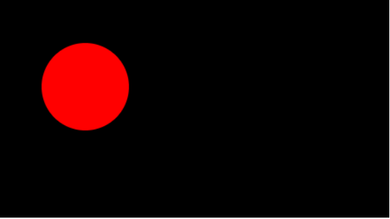
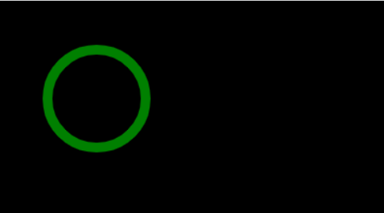

# Canvas API

The Canvas API provides a means for drawing graphics via JavaScript and the HTML `<canvas>` element. Among other things, it can be used for animation, game graphics, data visualization, photo manipulation, and real-time video processing.

## Project Setup


```html
<!DOCTYPE html>
<html lang="en">

<head>
    <meta charset="UTF-8">
    <meta http-equiv="X-UA-Compatible" content="IE=edge">
    <meta name="viewport" content="width=device-width, initial-scale=1.0">
    <link rel="stylesheet" href="styles.css">
    <title>Canvas Basics</title>
</head>

<body>

    <canvas id="canvas1"></canvas>

    <script src="main.js"></script>
</body>

</html>
```

```css
#canvas1 {
    position: absolute;
    background: #000;
    width: 100%;
    height: 100%;
    top: 0;
    left: 0;
}
```

```javascript
const canvas = document.getElementById("canvas1");
const ctx = canvas.getContext("2d");
const style = canvas.style;

// this is necessary for correct scaling
canvas.width = window.innerWidth;
canvas.height = window.innerHeight;


window.addEventListener("resize", () => {
    //This setup is to prevent stretching when resizing the window
    canvas.width = window.innerWidth;
    canvas.height = window.innerHeight;

    ctx.fillStyle = "white";
    //fillRect(x, y, width, height)
    ctx.fillRect(window.innerWidth / 2, window.innerHeight / 2, 100, 100);
});

ctx.fillStyle = "white";
//fillRect(x, y, width, height)
ctx.fillRect(window.innerWidth / 2, window.innerHeight / 2, 100, 100);
```

---

## Drawing a circle with the `arc` method

```javascript
ctx.fillStyle = "red";
//This basically tells JS to place the paintbrush on canvas and start drawing
ctx.beginPath();
//arc(x, y, radius, startAngle, endAngle) - Math.PI * 2 (2π) radians equals 360° (a full circle)
ctx.arc(100, 100, 50, 0, Math.PI * 2);
//fills the current or given path with the current fillStyle
ctx.fill();
```



```javascript
//specifies the color, gradient, or pattern to use for the strokes (outlines) around shapes
ctx.strokeStyle = "green";
//sets the thickness of lines
ctx.lineWidth = 10;
ctx.beginPath();

ctx.arc(100, 100, 50, 0, Math.PI * 2);
//strokes (outlines) the current or given path with the current stroke style.
ctx.stroke();
```


