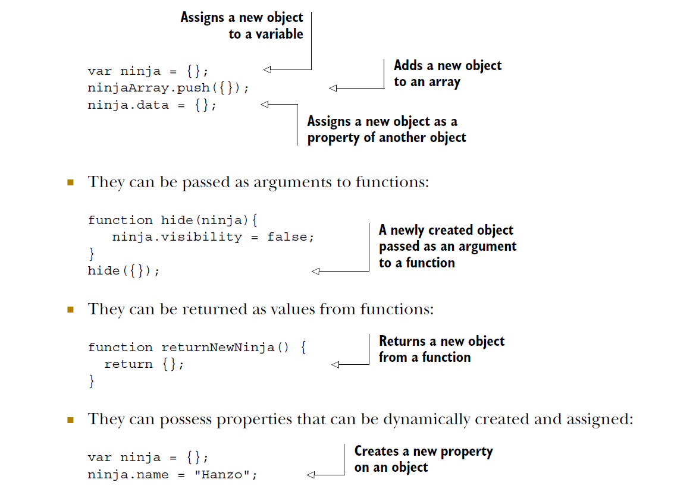

## First Class Functions: definitions and arguments

Most important, in JavaScript, functions are first-class objects, or first-class citizens as they’re often called. They coexist with, and can be treated like, any other JavaScript
object.

But first, let’s take a look at some of the actions we can take with objects. In JavaScript, objects enjoy certain capabilities:

* They can be created via literals: {}

* They can be assigned to variables, array entries, and properties of other objects:



It turns out that, unlike in many other programming languages, in JavaScript we can do almost the exact same things with functions also.

---

### Functions as first-class objects

Functions in JavaScript possess all the capabilities of objects and are thus treated like any other object in the language. We say that functions are first-class objects, which can
also be: 

* Created via literals

```javascript
function ninjaFunction() {}
```

* Assigned to variables, array entries, and properties of other objects:


```javascript
var ninjaFunction = function() {};
ninjaArray.push(function(){});
ninja.data = function(){};
```

* Passed as arguments to other functions

```javascript
function call(ninjaFunction){
ninjaFunction();
}
call(function(){});
```

* Returned as values from functions

```javascript
function returnNewNinjaFunction() {
return function(){};
}
```

* They can possess properties that can be dynamically created and assigned:

```javascript
var ninjaFunction = function(){};
ninjaFunction.name = "Hanzo";
```