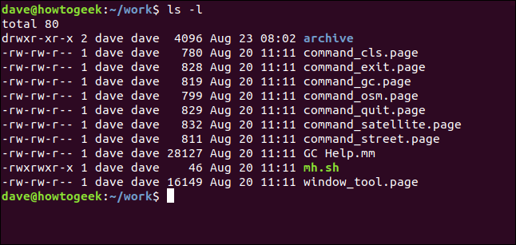
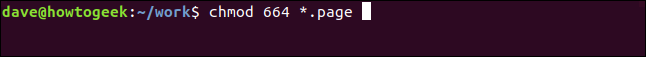

## Modify File Permissions - `chmod`

In Linux, who can do what to a file or directory is controlled through sets of permissions. There are three sets of permissions. One set for the owner of the file, another set for the members of the file’s group, and a final set for everyone else.

The permissions control the actions that can be performed on the file or directory. They either permit, or prevent, a file from being read, modified or, if it is a script or program, executed. For a directory, the permissions govern who can cd into the directory and who can create, or modify files within the directory.

We can use the -l (long format) option to have ls list the file permissions for files and directories.



On each line, the first character identifies the type of entry that is being listed. If it is a dash (-) it is a file. If it is the letter d it is a directory.

* The first three characters show the permissions for the user who owns the file (user permissions).

* The middle three characters show the permissions for members of the file’s group (group permissions).

* The last three characters show the permissions for anyone not in the first two categories (other permissions).

### The Permission Syntax

To use chmod to set permissions, we need to tell it:

* Who: Who we are setting permissions for.

* What: What change are we making? Are we adding or removing the permission?

* Which: Which of the permissions are we setting?


The “who” values we can use are:

* u: User, meaning the owner of the file.

* g: Group, meaning members of the group the file belongs to.

* o: Others, meaning people not governed by the u and g permissions.

* a: All, meaning all of the above.

**If none of these are used, chmod behaves as if “a” had been used.**


### Numerical Shorthand

Another way to use chmod is to provide the permissions you wish to give to the owner, group, and others as a three-digit number. The leftmost digit represents the permissions for the owner. The middle digit represents the permissions for the group members. The rightmost digit represents the permissions for the others.

* 0: (000) No permission.
* 1: (001) Execute permission.
* 2: (010) Write permission.
* 3: (011) Write and execute permissions.
* 4: (100) Read permission.
* 5: (101) Read and execute permissions.
* 6: (110) Read and write permissions.
* 7: (111) Read, write, and execute permissions.


For example, this sets the permissions we require for the user, group members, and others to what we require. The users and group members have their permissions reset to what they already were, and the others have the read permission restored.
```bash
chmod 664 *.page
```

#### `chown`
The chown command allows you to change the user and/or group ownership of a given file, directory, or symbolic link.


The chown command expressions takes the following form:
```bash
chown [OPTIONS] USER[:GROUP] FILE(s)
```



For more info, click here:
[chmod](https://www.howtogeek.com/437958/how-to-use-the-c

