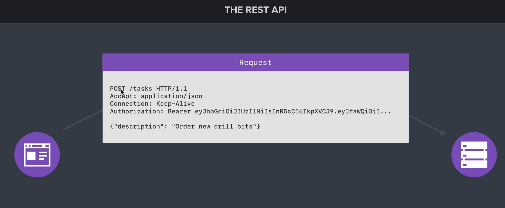

### Setting up Mongoose

Mongoose makes it easy to model and
manage your application data. This includes data sanitization, data validation, and more.
Mongoose will serve as a replacement for the native driver, providing for a more object-oriented interface.

```bash
npm i mongoose
```

```javascript
const mongoose = require('mongoose');

mongoose.connect('mongodb://127.0.0.1:27017/task-manager-api', {
useNewUrlParser: true,
useCreateIndex: true
})
```

### Defining a model

The model definition is where you define what makes up a user. This would include all the pieces of data you want to store in the database.

```javascript
const User = mongoose.model('User', 
{
    name: {
    type: String
},
    age: {
    type: Number
}
})


const me = new User({
name: 'Alek',
age: 26
})

//The new model instance can be saved to the database using the save method.

me.save().then(() => {
console.log(me)
}).catch((error) => {
console.log('Error!', error)
})
```

### Data Validation and Sanitization

The validator library provides useful methods for validating data such as email addresses,
phone numbers, zip codes, and more...

```bash
npm i validator
```

```javascript
const mongoose = require('mongoose')
const validator = require('validator')
const User = mongoose.model('User', {
name: {
type: String,
required: true,
trim: true
},
email: {
type: String,
required: true,
trim: true,
lowercase: true,
validate(value) {
if (!validator.isEmail(value)) {
throw new Error('Email is invalid')
}
}
}
})
```

### REST API

An API is an application programming interface. It is a set of rules that allow programs to talk to each other. The developer creates the API on the server and allows the client to talk to it.

REST determines how the API looks like. It stands for “Representational State Transfer”. It is a set of rules that developers follow when they create their API. One of these rules states that you should be able to get a piece of data (called a resource) when you link to a specific URL.

It’s important to know that a request is made up of four things:

* The endpoint (root-endpoint/?)

* The method

* The headers

* The data (or body)

The root-endpoint is the starting point of the API you’re requesting from. The root-endpoint of Github’s API is `https://api.github.com` while the root-endpoint Twitter’s API is `https://api.twitter.com`.

The path determines the resource you’re requesting for. Think of it like an automatic answering machine that asks you to press 1 for a service, press 2 for another service, 3 for yet another service and so on.

