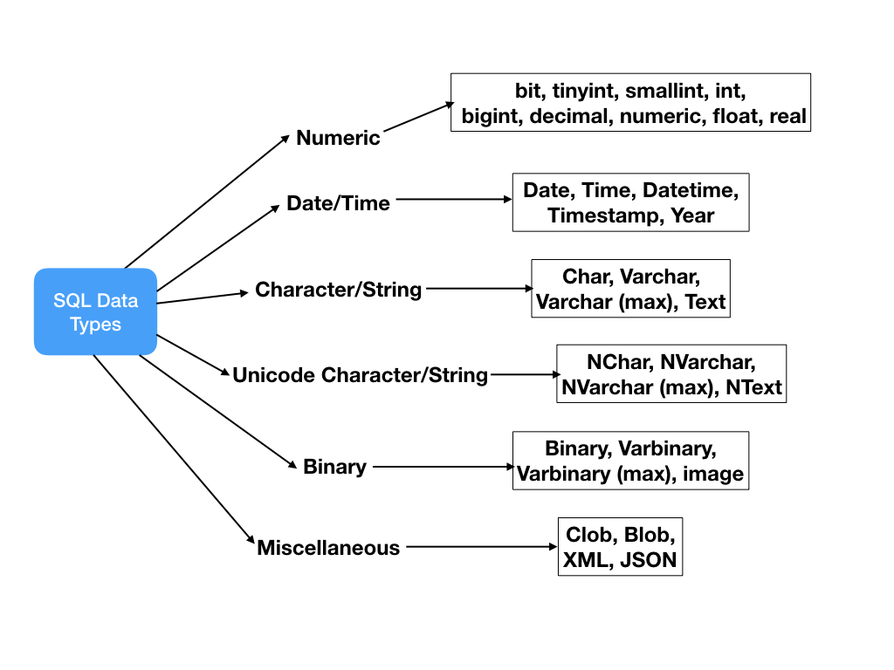

## Data Types

SQL data types can be broadly divided into following categories: 

* Numeric data types such as int, tinyint, bigint, float, real etc.

* Date and Time data types such as Date, Time, Datetime etc.

* Character and String data types such as char, varchar, text etc.

* Unicode character string data types, for example nchar, nvarchar, ntext etc.

* Binary data types such as binary, varbinary etc.

* Miscellaneous data types – clob, blob, xml, cursor, table etc.




### Char and Varchar

VARCHAR is variable length, while CHAR is fixed length. CHAR is a fixed length string data type, so any remaining space in the field is padded with blanks. CHAR takes up 1 byte per character. ... VARCHAR is a variable length string data type, so it holds only the characters you assign to it.

Char is faster for fixed length text.

### Decimals

```sql
decimal [(p [,s])]

# p stands for Precision, the total number of digits in the value, i.e. on both sides of the decimal point

# s stands for Scale, number of digits after the decimal point

# Example
INSERT INTO shop(item, price) VALUES('goat', 252.33);

```


### Float and Double

Float data can hold 8 bytes, or 15 places after the decimal point. Double data is similar to float, except that it allows for much larger numbers. They're used to specify precision, that is the number of whole numbers and number of digits shown after the decimal point of a complex number.
