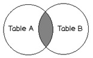

## One-to-many relationships

In a one-to-many relationship, one record in a table can be associated with one or more records in another table. For example, each customer can have many sales orders.

This is the most commonly used type of relationship. Consider an e-commerce website, with the following:

* Customers can make many orders.

* Orders can contain many items.

* Items can have descriptions in many languages.

In these cases we would need to create "One to Many" relationships. Here is an example:


Each customer may have zero, one or multiple orders. But an order can belong to only one customer.

---

When selecting data from multiple tables with relationships, we will be using the JOIN query. There are several types of JOIN's: 

* Cross Joins

* Natural Joins

* Inner Joins

* Left(Outer) Joins

* Right(Outer) Joins

---
1. Implicit Inner Join

* Inner join returns the rows that match in both tables




```bash
SELECT * FROM customers, orders 
WHERE customers.id = orders.customer_id;

SELECT first_name, last_name, order_date, amount
FROM customers, orders 
    WHERE customers.id = orders.customer_id;
```

2. Explicit Inner Joins

```bash
SELECT * FROM customers
JOIN orders
    ON customers.id = orders.customer_id;

SELECT first_name, last_name, order_date, amount 
FROM customers
JOIN orders
    ON customers.id = orders.customer_id;
```


3. Cross Joins

```bash
# 2 step process
SELECT id FROM customers WHERE last_name='George';
SELECT * FROM orders WHERE customer_id = 1;

#Using a subquery
SELECT * FROM orders WHERE customer_id =
    (
        SELECT id FROM customers
        WHERE last_name='George'
    );
```

4. Left Joins (use this one the most probably)

* Left join returns all rows from the left table


```bash
SELECT column_name(s)
FROM table1
LEFT JOIN table2
ON table1.column_name = table2.column_name;


SELECT * FROM customers
LEFT JOIN orders
    ON customers.id = orders.customer_id;


SELECT first_name, last_name, order_date, amount
FROM customers
LEFT JOIN orders
    ON customers.id = orders.customer_id; 


SELECT 
    first_name, 
    last_name,
    IFNULL(SUM(amount), 0) AS total_spent
FROM customers
LEFT JOIN orders
    ON customers.id = orders.customer_id
GROUP BY customers.id
ORDER BY total_spent;

```


5. Right Joins

* The RIGHT JOIN keyword returns all records from the right table (table2), and the matched records from the left table (table1). The result is NULL from the left side, when there is no match.


```bash
SELECT * FROM customers
RIGHT JOIN orders
    ON customers.id = orders.customer_id;
```

