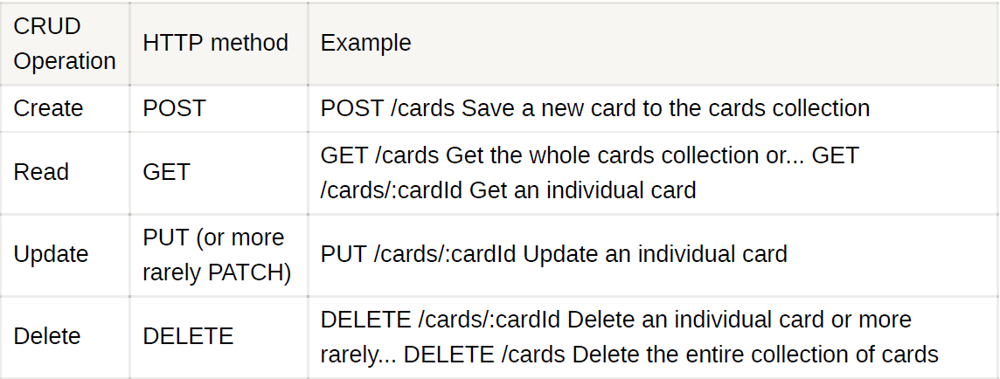

# Node Topics

## [Module System](./node/modules.md)

## [Planets Project](./node/planets/planets.md)


# Node.js

Node.js is an open-source and cross-platform JavaScript runtime environment. It's a platform built on Chrome's JavaScript runtime for easily building fast and scalable network applications.

Node.js uses an event-driven, non-blocking I/O model that makes it lightweight and efficient, perfect for data-intensive real-time applications that run across distributed devices.

## Features of Node.js

Important features of Node:

* **Asynchronous and Event Driven** 

* **Single Threaded but Highly Scalable**

* **No Buffering**

**NOTE:** buffer = a region of a memory used to temporarily store data while it is being moved from one place to another.

**NOTE:** JS is synchronous BUT being run in the browser or terminal, it has asynchronous functionality thanks to Node.

### libuv

**libuv** is a multi-platform support library with a focus on asynchronous I/O. It was primarily developed for use by Node.js, but it's also used by Luvit, Julia, uvloop, and others.

## Global Object

In Node, we have a `global` object that we can always access. Features that we expect to be available everywhere live in this `global` object.


```javascript
// Probably the most famous global is global.console.log - we omit the global

//global.setTimeout
setTimeout(() => {
console.log('hello');
}, 5000);

```


## Module System

In Node.js each file is treated as a separate module. Modules provide us a way of reusing existing code. Node.js uses the concept of a module as the fundamental means for structuring the code of a program. It is the building block for creating applications and reusable
libraries.

### The `require()` function

```javascript
// We can re-use existing code with require() - it imports code from another module
const fs = require('fs');
fs.readFileSync('hello.txt');
// OR...
const { readFileSync } = require('fs');
readFileSync('hello.txt');
```


## Built-in Modules

Key built-in modules include:

* fs - read and write files on your file system

* path - combine paths regardless of which OS you're using

* process - information about the currently running process, e.g. process.argv for arguments passed in or process.env for environment variables

* http - make requests and create HTTP servers

* https - work with secure HTTP servers using SSL/TLS

* events - work with the EventEmitter

* crypto - cryptography tools like encryption and hashing


## Creating Modules

```javascript
// In src/fileModule.js
function read(filename) { }
function write(filename, data) { }
module.exports = {
read,
write,
};
// In src/sayHello.js
const { write } = require('./fileModule.js')
write('hello.txt', 'Hello world!');
```

Some Node modules may instead use the shorthand syntax to export functions.

```javascript
// In src/fileModule.js
exports.read = function read(filename) { }
exports.write = function write(filename, data) { }
```

## Event Loop

Event Loop Features: 

* The event loop is what allows Node.js to perform non-blocking I/O operations — despite the fact that JavaScript is single-threaded — by offloading operations to the system kernel whenever possible.

* The event loop executes tasks from the event queue only when the call stack is empty i.e. there is no ongoing task.

* The event loop allows us to use callbacks and promises.

* The event loop executes the tasks starting from the oldest first.


### Phases of the Event loop

---


## Event Emitter

Node.js provides a built-in module to work with events.

```javascript
const EventEmitter = require('events');
const celebrity = new EventEmitter();
celebrity.on('success', () => {
console.log('Congratulations! You are the best!');
});
celebrity.emit('success'); // logs success message
celebrity.emit('success'); // logs success message again
celebrity.emit('failure'); // logs nothing
```

Many features of Node are modelled with the EventEmitter class. Some examples
include the currently running Node `process` , a running HTTP server, and web sockets.
They all emit events that can then be listened for using a listener function like `on()` .

For example, we can listen for the exit event on the current running process. In this
case, the event has a code associated with it to be more specific about how the process is exiting.

```javascript
const process = require('process');
process.on('exit', (code) => {
console.log(`About to exit with code: ${code}`);
});
```


## Backend Concepts

### Client-server architecture
Your frontend is usually the client. Your backend is usually the server.
In a client-server architecture, clients get access to data (or "resources") from the server. The client can then display and interact with this data. The client and server communicate with each other using the HTTP protocol.

### API
Short for Application Programming Interface. This is the set of functions or operations that your backend server supports. The frontend interacts with the backend by using only these operations. On the web, backend APIs are commonly defined by a list of URLs, corresponding HTTP methods, and any queries and parameters.

### CRUD
Short for Create Read Update and Delete. These are the basic operations that every API supports on collections of data. Your API will usually save (or "persist") these collections of data in a database.

### RESTful
RESTful APIs are those that follow certain constraints. These include:

* Client-server architecture. Clients get access to resources from the server using the HTTP protocol.

* Stateless communication. Each request contains all the information required by the server to handle that request. Every request is separate from every other request.

* Cacheable. The stateless communication makes caching easier.

In RESTful APIs each of our CRUD operations corresponds to an HTTP method:



## Express Routes

### GET Routes

```javascript
// Get a whole collection of JSON objects
app.get("/cards", (req, res) => {
return res.json(cards);
});
// Get a specific item in a collection by ID
app.get("/cards/:cardId", (req, res) => {
const cardId = req.params.cardId;
return res.json(cards[cardId]);
});
```

### POST Routes

```javascript
app.post("/cards", (req, res) => {
// Get body from the request
const card = req.body;
// Validate the body
if (!card.value || !card.suit) {
return res.status(400).json({
error: 'Missing required card property',
});
}
// Update your collection
cards.push(card);
// Send saved object in the response to verify
return res.json(card);
});
```

### Routers

```javascript
// In src/cards.router.js
const cardsRouter = express.Router();
cardsRouter.get("/", (req, res) => {
return res.json(cards);
});
cardsRouter.get("/:cardId", (req, res) => {
const cardId = req.params.cardId;
return res.json(cards[cardId]);
});
// In src/api.js
const cardsRouter = require('./cards.router');
const api = express.Router();
api.use('/cards', cardsRouter);
```


## Folder Structure


## Cross Origin Resource Sharing (CORS)

Browsers follow the Same Origin Policy (SOP), which prevents requests being made across different origins. This is designed to stop malicious servers from stealing information that doesn't belong to them.

**CORS** allows us to allow or whitelist other origins
that we trust, so that we can make requests to servers that don't belong to us.

---
### Node best practices - https://github.com/goldbergyoni/nodebestpractices