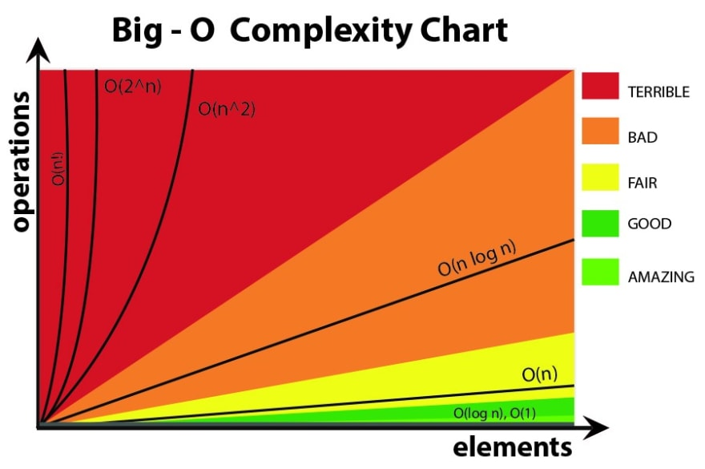

# Big-O Notation

Big O notation is a mathematical notation that describes the limiting behavior of a function when the argument tends towards a particular value or infinity.

In normal people talk, it means that Big O describes the complexity of your code using algebraic terms.


## 1. `O(n)` - Linear Time

```python
def print_items(n):
    for i in range(n):
        print(i)

# This has an O(n)
```

* Drop constants

```python
def print_items(n):
    for i in range(n):
        print(i)
        
    for j in range(n):
        print(j)
# This would be O(2n) or O(n + n)
# We can simplify this by dropping the constant and write it O(n), even if it's O(4n) or O(10n)
```

## 2. O(n<sup>2</sup>)

```python
def print_items(n):
    for i in range(n):
        for j in range(n):
            for k in range(n):
                print(i, j, k)

# This would be n * n * n or n^3 - but we simplify this as O(n^2)

# O(n^2) is a lot less efficient from a time complexity standpoint
```

* Drop Non-Dominants

```python
def print_items(n):
    for i in range(n):
        for j in range(n):
            print(i, j)
    # This loop has an O(n^2) complexity


    for k in range(n):
        print(k)
    # This loop has an O(n) complexity

# Together is O(n^2 + n)

# O(n^2) is the DOMINANT term, O(n) is the NON-DOMINANT term, so we drop it because when the numbers get really huge, that second n won't make a difference

# So we write it as O(n^2)
```

## 3. O(1) - Constant Time

```python
def add_items(n):
    return n + n + n

# Constant time algorithms will always take same amount of time to be executed

# A good example of O(1) time is accessing a value with an array index. Other examples include: push() and pop() operations on an array.
```

## 4. O(log n)

```python
list = [1, 2, 3, 4, 5, 6, 7, 8]
```

We are going to look for the number 1 - not knowing exactly where it is in the list

1. We take the list and divide it in half so it's [1, 2, 3, 4] and [5, 6, 7, 8] We check if it's in the second half. Since it isn't, we remove the second half completely and continue searching in the 1st half.

2. We repeat the process with [1, 2, 3, 4], we divide it in 2 parts and check if it it's in each one

3. We divide it a 3rd time and we find the number

This took 3 steps or operations in a list with 8 items - 2<sup>3</sup> = 8

2<sup>3</sup> = 8 is the same as saying log<sub>2</sub> = 8 (2<sup>?</sup> = 8)

How many times do you have to divide 8 by 2 to get to one item?


### 


## 5. Different Terms for Inputs

When we have 2 different params, we can't say it's simply O(n). We can't say a = n and b = n, they are two different things.

The most we can simplify this is say it is O(a + b).

```python
def print_items(a, b):
    for i in range(a):
        print(i)

    for j in range(b):
        print(j)
```


With a nested loop like below, it would be O(a * b)
```python
def print_items(a, b):
    for i in range(a):
        for j in range(b):
            print(i, j)
```

## 6. Big O - Lists

```python

my_list = [11, 3, 23, 7]


# Both of these methods are equal to 1 operation, there is no need for reindexing since append() appends an items at the end of the list and pop() removes the last item
my_list.append(30)
my_list.pop()


# This time, there is reindexing for all the items in the list, hence this is a O(n)
my_list.pop(0)
my_list.insert(0, 11)

```