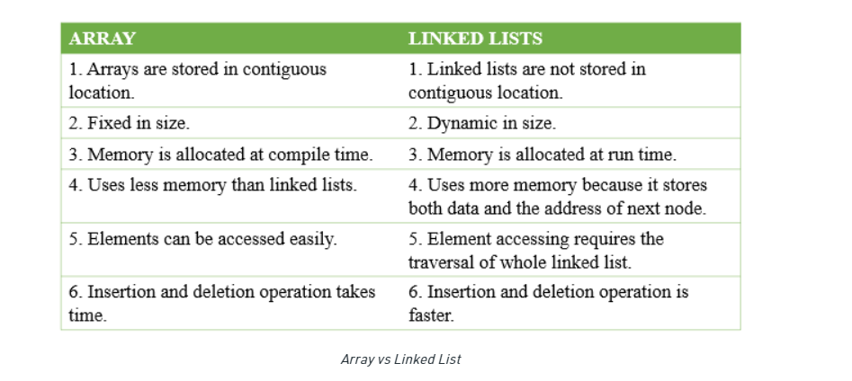
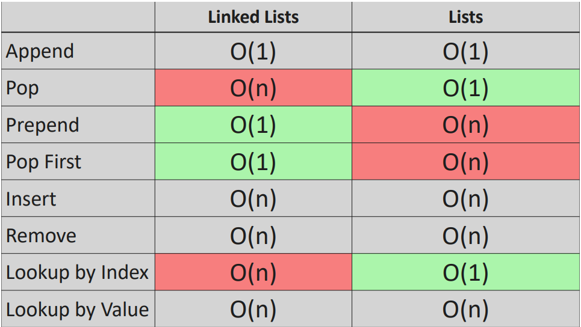

# Linked Lists


## 1. Basics

Like arrays, Linked List is a linear data structure. Unlike arrays, linked list elements are not stored at a contiguous location; the elements are linked using pointers.

A linked list doesn't have indexes.

In simple words, a linked list consists of nodes where each node contains a data field and a reference(link) to the next node in the list.




### Types of Linked List:

* Simple Linked List

* Doubly Linked List

* Circular Linked List

### Terminology

* The next reference inside a node can be viewed as a **link** or **pointer** to another node.

* The first and last node of a linked list usually are called the **head** and **tail** of the list, respectively. Thus, we can traverse the list starting at the head and ending at the tail. The tail node is a special node, where the next pointer is always pointing or linking to a null reference, indicating the end of the list.

## 2. Big-O for Linked List & List




## 3. Linked List Constructor

```python
class Node:
    def __init__(self, value):
        self.value = value
        self.next = None


class LinkedList:
    def __init__(self, value):
        new_node = Node(value)
        # when there's 1 node, both the tail and head point to it
        self.head = new_node
        self.tail = new_node
        # keep track of how many nodes
        self.length = 1

    # Prints out all nodes in the list
    def print_list(self):
        temp = self.head
        while temp is not None:
            print(temp.value)
            temp = temp.next


my_linked_list = LinkedList(4)
```

## 4. Append Node

```python
    def append_node(self, value):
        new_node = Node(value)
        # Check if there aren't any nodes
        if self.head is None:
            self.tail = new_node
            self.head = new_node
            self.length = 1
        else:
            # Set the tail and pointer to the new node
            self.tail.next = new_node
            self.tail = new_node
            # Increase ll length
            self.length += 1

            return True
```

## 5. Pop Node

```python
    def pop_node(self):
        # If list is empty
        if self.length == 0:
            return None

        temp = self.head
        pre = self.head
        # This will be false for the last item of the list, the one we want to remove
        while temp.next:
            pre = temp
            temp = temp.next
        self.tail = pre
        self.tail.next = None
        self.length -= 1

        # this is after decrementing the length
        if self.length == 0:
            self.head = None
            self.tail = None

        # return the popped node value
        return temp.value
```

