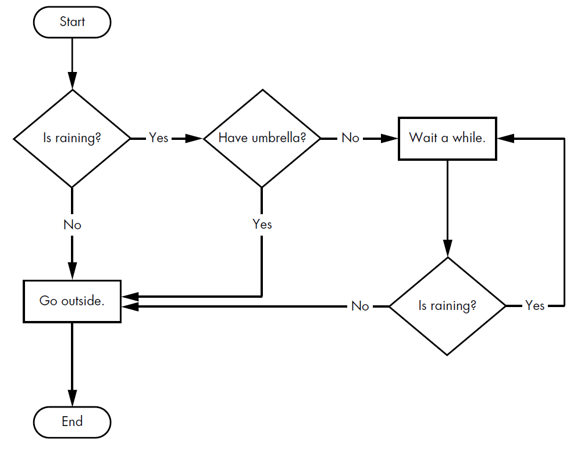
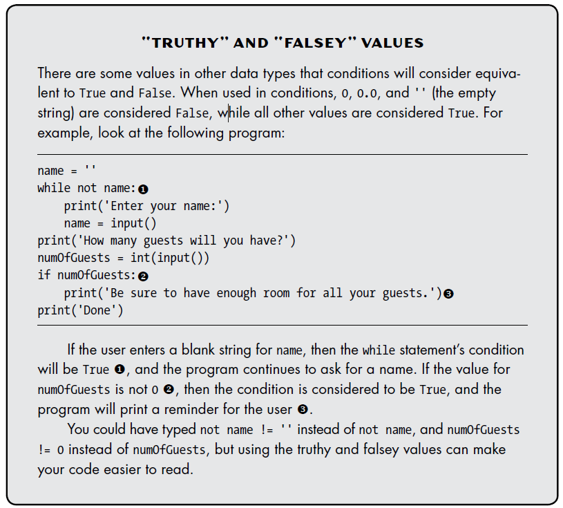

## Flow Control



### Boolean Values

**Note: In Python, they
always start with a capital T or F.**

```python
isRaining = True

hasDriversLicence = False
```


### Comparison Operators

* '==' - Equal to
* '!=' - Not equal to
* '<' - Less than
* '>' - Greater than
* '<=' - Less than or equal to
* '>=' - Greater than or equal to

```python
>>> 42 == 42
True
>>> 42 == 99
False
>>> 2 != 3
True
>>> 2 != 2
False
```

#### The Difference Between the == and = Op erators


* The == operator (equal to) asks whether two values are the same as each
other.

* The = operator (assignment) puts the value on the right into the variable
on the left.

### Boolean Operators

The three Boolean operators (and, or, and not) are used to compare Boolean
values.

The and and or operators always take two Boolean values (or expressions),
so they’re considered binary operators.

```python
>>> True and True
True
>>> True and False
False
```

```python
>>> False or True
True
>>> False or False
False
```

#### The `not` Operator

Unlike and and or, the not operator operates on only one Boolean value (or
expression). The not operator simply evaluates to the opposite Boolean value.

```python
>>> not True
False
>>> not not not not True
True
```

### Mixing Boolean and Comparison Operators

```python
>>> (4 < 5) and (5 < 6)
True
>>> (4 < 5) and (9 < 6)
False
>>> (1 == 2) or (2 == 2)
True
```

The computer will evaluate the left expression first,
and then it will evaluate the right expression.

---

## Elements of Flow Control

Flow control statements often start with a part called the condition, and all are followed by a block of code called the clause.

#### Blocks of Code

Lines of Python code can be grouped together in blocks. You can tell when a
block begins and ends from the  indentation of the lines of code. There are three rules for blocks: 

1. Blocks begin when the indentation increases.
2. Blocks can contain other blocks.
3. Blocks end when the indentation decreases to zero or to a containing
block’s indentation.

```python
if name == 'Mary':
    print('Hello Mary')
if password == 'swordfish':
    print('Access granted.')
else:
    print('Wrong password.')
```


### Flow Control Statements

#### `if` Statements

```python
if name == 'Alice':
    print('Hi, Alice.')
```

#### `else` Statements

An if clause can optionally be followed by an else statement. The else clause is executed only when the if statement’s condition is False.

```python
if name == 'Alice':
    print('Hi, Alice.')
else:
    print('Hello, stranger.')
```

#### `elif` Statements

While only one of the `if` or `else` clauses will execute, you may have a case where you want one of many possible clauses to execute. The `elif` statement is an “else if” statement that always follows an `if` or another `elif` statement.

```python
if name == 'Alice':
    print('Hi, Alice.')
elif age < 12:
    print('You are not Alice.')
```

When there is a chain of `elif`statements, only one or none of the clauses will be executed. Once one of the statements’ conditions is found
to be True, the rest of the `elif ` clauses are automatically skipped.

---

### `while` Loop Statements

You can make a block of code execute over and over again with a while statement.

```python
spam = 0
while spam < 5:
    print('Hello, world.')
    spam = spam + 1
```

### `break` Statements
If the execution reaches a break statement, it immediately exits the while loop’s clause.

```python
while True:
    print('Please type your name.')
    name = input()
    if name == 'your name':
        break
print('Thank you!')
```

**Note: The first line creates an infinite loop.**

### `continue` Statements

When the program execution reaches a `continue` statement, the program execution immediately jumps back to the start of the loop and reevaluates the loop’s condition.

```python
while True:
    print('Who are you?')
    name = input()
    if name != 'Joe':
        continue
    print('Hello Joe. What is the password? (It is a fish.)')
    password = input()
    if password == 'swordfish':
        break
print('Access Granted')
```

#### “Truthy” and “Falsey” Values



### for Loops and the range() Function

The `while` loop keeps looping while its condition is True (which is the reason for its name), but what if you want to execute a block of code only a certain
number of times? You can do this with a `for` loop statement and the `range()`
function.

```python
print('My name is')
for i in range(5):
    print('Jimmy Five Times (' + str(i) + ')')
```

You can use break and continue statements inside for loops as well. The continue
statement will continue to the next value of the for loop’s counter, as if the program
execution had reached the end of the loop and returned to the start. In fact, you can
use continue and break statements only inside while and for loops. If you try to use
these statements elsewhere, Python will give you an error.

#### An Equivalent `while` Loop

```python
print('My name is')
i = 0
while i < 5:
    print('Jimmy Five Times (' + str(i) + ')')
    i = i + 1
```

#### The Starting, Stopping, and Stepping Arguments to `range()`

Some functions can be called with multiple arguments separated by a
comma, and `range()` is one of them. This lets you change the integer passed
to `range()` to follow any sequence of integers, including starting at a number
other than zero.

```python
for i in range(12, 16):
    print(i)
```

The first argument will be where the for loop’s variable starts, and the
second argument will be up to, but not including, the number to stop at.

The `range()` function can also be called with three arguments. The first
two arguments will be the start and stop values, and the third will be the
step argument. The step is the amount that the variable is increased by after
each iteration.

```python
for i in range(0, 10, 2):
    print(i)

0
2
4
6
8
```
---

### Importing Modules

All Python programs can call a basic set of functions called built-in functions,
including the print(), input(), and len() functions you’ve seen before. Python
also comes with a set of modules called the standard library.

Before you can use the functions in a module, you must import the
module with an import statement. In code, an import statement consists of
the following:

* The import keyword

* The name of the module

* Optionally, more module names, as long as they are separated by
commas

```python
import random

for i in range(5):
    print(random.randint(1, 10))
```

The `random.randint()` function call evaluates to a random integer value
between the two integers that you pass it. Since `randint()` is in the random
module, you must first type random. in front of the function name to tell
Python to look for this function inside the random module.

#### `from` import Statements

An alternative form of the `import` statement is composed of the `from` keyword,
followed by the module name, the `import` keyword, and a star; for
example, `from random import` *.
With this form of `import` statement, calls to functions in `random` will not
need the random. prefix. However, using the full name makes for more readable
code, so it is better to use the normal form of the `import` statement.

---

### Ending a Program Early with `sys.exit()`

You can cause the program to terminate, or exit, by calling the `sys.exit()` function.

```python
import sys
while True:
    print('Type exit to exit.')
    response = input()
    if response == 'exit':
        sys.exit()
print('You typed ' + response + '.')
```