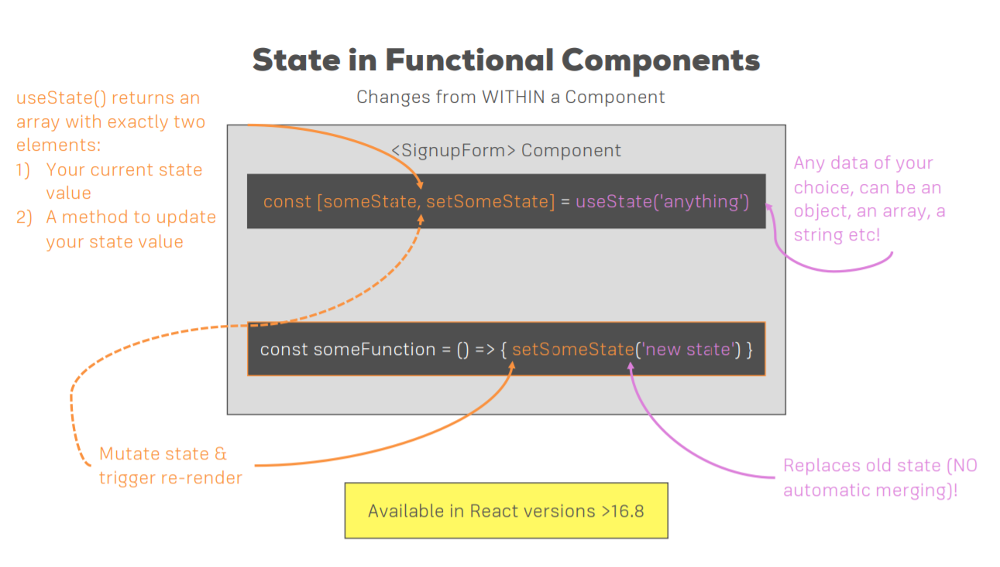

## React Hooks

Hooks let you use state and other React features without writing a class.

Hooks are functions that let you “hook into” React state and lifecycle features from function components. Hooks don’t work inside classes — they let you use React without classes.

Hooks are JavaScript functions, but they impose two additional rules:

* Only call Hooks at the top level. Don’t call Hooks inside loops, conditions, or nested functions.

* Only call Hooks from React function components. Don’t call Hooks from regular JavaScript functions. (There is just one other valid place to call Hooks — your own custom Hooks.)

### `useState()` Hook



```javascript
import React, { useState } from 'react';

const Counter = () => {

    const [count, setCount] = useState(0)

    function decrementCount() {
        setCount(prevCount => prevCount - 1);
    }

    function incrementCount() {
        setCount(prevCount => prevCount + 1);
    }

    return (
        <div>
            <button onClick={decrementCount}>-</button>
            <span>{count}</span>
            <button onClick={incrementCount}>+</button>
        </div>
    )
}

export default Counter;
```