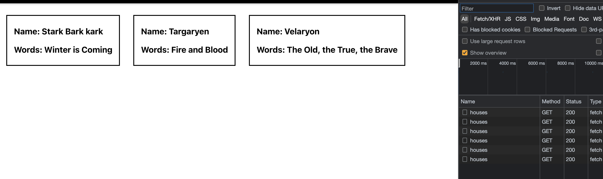

# React Query

React Query is a library that makes fetching, caching, synchronizing and updating server state very easy.

It's compatible with React v16.8+ and works with ReactDOM and React Native.

Installation

```bash
npm i react-query
```

## Quick Start

1. Wrap the entire App component with the QueryClientProvider
2. Create an instance of the Query Client and pass it to the QueryClientProvider

```JSX
// app-name/src/App.js

import { BrowserRouter as Router, Routes, Route, Link } from 'react-router-dom'
import {QueryClientProvider, QueryClient} from "react-query"
//import Pages as well

const queryClient = new QueryClient()


function App() {
  return (
    <QueryClientProvider client={queryClient}>
    <Router>
      <div>
        <nav>
          <ul>
            <li>
              <Link className='nav-link' to='/'>Home</Link>
            </li>
            <li>
              <Link className='nav-link' to='/dragons'>Dragons</Link>
            </li>
            <li>
              <Link className='nav-link' to='/rq-dragons'>RQ Dragons</Link>
            </li>
          </ul>
        </nav>
        <Routes>
          <Route path={'/dragons'} element={<DragonsPage />} />
          <Route path={'/rq-dragons'} element={<RQDragonsPage />} />
          <Route path={'/'} element={<HomePage />} />
        </Routes>
      </div>
    </Router>
    </QueryClientProvider>
  );
}
```

3. Go to the component where you want to fetch the data and import `useQuery` hook from react-query. React Query manages query caching based on query keys, which is the first argument of the `useQuery` hook. Query keys have to be an Array at the top level, and can be as simple as an Array with a single string, or as complex as an array of many strings and nested objects.

4. Destructure the stuff that you need from useQuery, for example isLoading and the data.

5. Do whatever you want.

```JSX
// app-name/src/components/RQDragons.page.js
import { useQuery } from 'react-query'

const RQDragonsPage = () => {

    const {isLoading, data} = useQuery(['dragons'], async () => {
       const response =  await fetch('http://localhost:4000/dragons');

       return await response.json();

    })

  return (
    <div>
        {isLoading ?
        <div>Loading data...</div> :

        <div>
            {data.map((dragons) =>
            <div key={dragons.id}>
                <h3>Name: {dragons.name}</h3>
            </div>)}
        </div>}
    </div>
  )
}
```

```JSX
// app-name/src/components/RQDragons.page.js


    // You can also separate the logic like below - a common pattern
    const fetchData = async () => {
        const response = await fetch fetch('http://localhost:4000/dragons');

        return await response.json();
    }

    const {isLoading, data} = useQuery(['dragons'], fetchData);
```

## Error Handling

React Query needs a rejected Promise in order to handle errors correctly. We get this with libraries like `axios`. With Fetch API you aren't getting a Promise on erroneous status codes (404, 500 etc.).

With Fetch API

```JSX
// app-name/src/components/RQDragons.page.js

const fetchData =  async() => {
  //wrong url
  const response =  await fetch('http://localhost:4000/dragonss')

  if(!response.ok) {
    throw new Error(`${response.status} - ${response.statusText}`)
  }

  return response.json()
}

const RQDragonsPage = () => {
    const {isError, error, data, isLoading} = useQuery('dragons', fetchData);

    if(isLoading) {
      return <h3>Loading data...</h3>
    }

    if(isError) {
      return <h3>{error.message}</h3>
    }
    /*
        return
        <div>
            ...
        </div>
    */
}
```

With Axios

```JSX
// app-name/src/components/RQDragons.page.js

const fetchData =  () => {
  return axios.get('http://localhost:4000/dragons')
}

const RQDragonsPage = () => {
    const {isError, error, data, isLoading} = useQuery('dragons', fetchData);

    if(isLoading) {
      return <h3>Loading data...</h3>
    }

    if(isError) {
      return <h3>{error.message}</h3>
    }
    /*
        return
        <div>
            ...
        </div>
    */
}
```

## React Query Dev Tools

```JSX
// app-name/src/App.js

import {ReactQueryDevtools} from "react-query/devtools"


function App() {
  return (
    <QueryClientProvider client={queryClient}>
    <Router>
      <div>
        <nav>
          Links..
        </nav>
        <Routes>
          Routes...
        </Routes>
      </div>
    </Router>
    {/* Include the component just before the closing provider tag
      initialIsOpen -> should dev tools be open by default


      you should see the React Query logo in your web page
    */}
    <ReactQueryDevtools initialIsOpen={false} position={"bottom-right"} />
    </QueryClientProvider>
  );
}
```

## Query Cache

By default, every query result is cached for 5 minutes and React Query relies on that cache for subsequent requests.

React Query will check if the data for the made query exists in cache. If it does, the cached data is immediately returned without `isLoading` set to `true`.

Since `isLoading` is not changed, `isFetching` is used to indicate the background refetching of the query.

```JSX
    const {isError, error, data, isLoading, isFetching} = useQuery('dragons', fetchData);
```

Things to consider when it comes to caching:

- Rendered query results will become stale after they are resolved. This means that they will be refetched automatically on every new mount or page focus if the `refetchOnWindowFocus` property is active. To avoid this, we should specify the `staleTime` property.

- Stale queries will be refetched when the browser window is refocused by the user. To avoid this, we should alter the `refetchOnWindowFocus` property.

## Stale Time & Cache Time

`staleTime` tells you how fresh you data is. So if you set staleTime: 120000, in your example, you're guaranteed to not get another network request for two minutes after the first successful one.

`cacheTime` is something totally different. Think about it as a garbage-collect time. It basically describes how long data should be kept in the cache before it can be garbage collected. This is only relevant for unused queries, because active queries can per definition not be garbage collected.

To highlight the differences between the two:

- StaleTime: The duration until a query transitions from fresh to stale. As long as the query is fresh, data will always be read from the cache only - no network request will happen! If the query is stale (which per default is: instantly - 0 seconds), you will still get data from the cache, but a background refetch can happen under certain conditions.

- CacheTime: The duration until inactive queries will be removed from the cache. This defaults to 5 minutes. Queries transition to the inactive state as soon as there are no observers registered, so when all components which use that query have unmounted.

## Refetch Defaults - `refetchOnMount` & `refetchOnWindowFocus`

- `refetchOnMount`

  - Defaults to `true`
  - If set to `true`, the query will refetch on mount if the data is stale.
  - If set to "always", the query will always refetch on mount.

- `refetchOnWindowFocus`

  - Defaults to `true`
  - If set to `true`, the query will refetch on window focus if the data is stale.
  - If set to "always", the query will always refetch on window focus.

The traditional way of fetchin data is done so that the data is being fetched every time the component mounts.

```JSX
const RQDragonsPage = () => {
    const {isError, error, data, isLoading} = useQuery('houses', fetchData, {
      refetchOnMount: true,
      refetchOnWindowFocus: true
    });

    if(isLoading) {
      return <h3>Loading data...</h3>
    }

    if(isError) {
      return <h3>{error.message}</h3>
    }

   /*
    ...
   */
```

## Polling

Polling refers to the process of fetching data at regular intervals. For example, if you have a component that shows the real-time price of different stocks, you might want to fetch data every second to update the UI.

We can do this with `refetchInterval`.

- `refetchInterval`

  - If set to a number, all queries will continuously refetch at this frequency in milliseconds

  - If set to a function, the function will be executed with the latest data and query to compute a frequency

```JSX
    const {isError, error, data, isLoading} = useQuery('houses', fetchData, {
      refetchInterval: 3000
    });
```

As the code above states, a new request will be made every 3 seconds.



**NOTE: Polling is paused when the window loses focus.**

If you want refetching to continue in the background, use `refetchIntervalInBackground`.

- `refetchIntervalInBackground`

  - If set to true, queries that are set to continuously refetch with a refetchInterval will continue to refetch while their tab/window is in the background

```JSX
    const {isError, error, data, isLoading} = useQuery('houses', fetchData, {
      refetchInterval: 3000,
      refetchIntervalInBackground: true
    });
```
