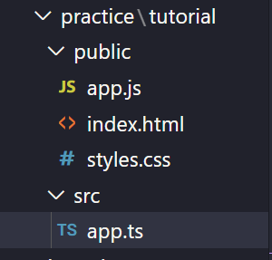

## TypeScript 
---
## [TypeScript with React](./r-type.md)
---

TypeScript is a typed superset of JavaScript that compiles to plain JavaScript. It offers classes, modules, and interfaces to help you build robust components.

* Alternative to JavaScript (superset - which basically means that it extends the abilities of JavaScript)

* Allows us to use strict types

* Supports modern features(arrow funcs, let, const)

* Needs to be compiled into JS code

* Extra features like: generics, interfaces, tuples etc.

---

## Compiling TypeScript

To be able to compile, install typescript first as shown below.

```bash
npm install -g typescript
```

Make sure you are in the desired directory, and have a .ts file and a .js file (preferably with the same name)

```bash
tsc filename.ts filename.js
```

In order not to keep compiling the code, run the following command:

```bash
tsc filename.ts -w
```

---

## Type Basics

```javascript
//String
let name: string = "something";

//Number
let num: number = 42;

//Boolean
let isValid: boolean = true;

//Object
let wizard: object = {
    a: "Something"
}

//Array

let pets: string[] = ["cat", "dog", "rhinoceros"];

let pets2: Array<string> = ["lion", "dragon", "mouse"];

//Null & undefined
let meh: undefined = undefined;

let noo: null = null;

//Tuple - can contain two values of different data types.

let basket: [string, number] = ["bananas", 3];

//Enum - allow us to declare a set of named constants i.e. a collection of related values that can be numeric or string values (Typically names with a capital 1st letter)

enum Size {Small = 1, Medium = 2, Large = 3};

let currentSize: string = Size[2];
console.log(currentSize) // Medium
let sizeNum: number = Size.Large;


// Interface - a structure that defines the contract in your application. It defines the syntax for classes to follow

interface IEmployee {
    empCode: number;
    empName: string;
    getSalary: (number) => number; // arrow function
    getManagerName(number): string; 
}


```
---

## Union Types

Occasionally, you’ll run into a library that expects a parameter to be either a number or a string. We do this with adding union types.

```javascript
let mixed: (string | number)[] = [];

mixed.push('hello'); // this is ok
mixed.push(20); // this is ok
mixed.push(false); // this is NOT ok

//-----------------------------------
let strOrNum: string | number;

strOrNum = "hello"; // this is ok
strOrNum = 3; // this is ok
strOrNum = true; // this is NOT ok
```

```javascript
//Objects
let user: object;
user = {name: 'Hank', age: 20};
user = []; // this works because an array is also an object

let user2: {
    name: string,
    age: number,
    isLoggedIn: boolean
}
```

---

## Dynamic (any) Types

```javascript
let age: any = 25;
age = false; // this works because the type was declared as any

// any is basically reverting typescript to javascript

let person: {name: any; age: any};
```

---

## Function Basics

```javascript
//Explicitly defining function type

let greet: Function;

//Explicitly defining function argument types
const add = (a: number, b: number) => {
    return a + b;
}

//Optional arguments
const greetPerson = (greet: string, personName?: string) => {
    // Use ?: to make it optional, if you don't and you forget to include the second argument, it will throw an error
}

const subtract = (a: number, b: number, c = 10) => {
    //If you give an argument a default value, you don't have to use ?: to make it optional
    return a - b - c
}

// The type is inferred by the return value of the function, which is a number in this case
let result = subtract(50, 10);

//Changing it to something else will give you an error
result = "mike";


//You an also declare the return type of a function like so
const personInfo = (name: string, age: number): Object => {
    return {
        name,
        age
    }
}

//When there is no return value, you can declare the return type of the function as void
const printToConsole = (): void => {
    console.log(1, 2, 3);
}

//never type is used when you are sure that something is never going to occur.
function throwError(errorMsg: string): never { 
            throw new Error(errorMsg); 
}

let greet: (a: string, b: string) => void;

//this has to match the signature above, name & greeting have to be strings as declared above
greet = (name: string, greeting: string) => {
    return `${greeting}, ${name}!`
}

//Here's another example
let calc: (a: number, b: number, c: string) => number;

calc = (num1: number, num2: number, action: string) => {
    switch (action) {
        case "add":
            return num1 + num2;
        case "subtract":
            return num1 - num2;
        case "multiply":
            return num1 * num2;
        case "divide":
            return num1 / num2;
        default:
            return 1;
    }
}
```

---

## Type Aliases

```javascript
//In order not to repeate code, you can declare type aliases like so

type StringOrNum = string | number;
type boolOrStr = boolean | string;

let newFunc = (value1: StringOrNum, value2: boolOrStr) => {
    //function logic
}

// We can do the same with objects
type objWithName = {name: string, uid: StringOrNum};

const greet = (user: objWithName) => {
    console.log(`${user.name} says hello`)
}
```
---

## The DOM & Type Casting

```javascript
const anchor = document.querySelector("a");

//If you try this, it will give you an error
console.log(anchor.hrer); 

//So you add an ! mark at the end of the query selector, like so:
const anchor = document.querySelector("a")!;

// OR
console.log(anchor?.hrer); 
```

```javascript
//If you do this, it will show that form is of type Element, since you're grabbing it by the class name
const form = document.querySelector('.new-item-form');

//So what we can do is this
const form = document.querySelector('.new-item-form') as HTMLFormElement;
const type = document.querySelector("#type") as HTMLSelectElement;
const toFrom = document.querySelector("#toFrom") as HTMLInputElement;
```

```javascript
const form = document.querySelector('.new-item-form') as HTMLFormElement;

//event objects take Event as a type
form.addEventListener("submit" ,(e: Event) => {
    e.preventDefault();
    console.log(
        type.value,
        toFrom.value,
        details.value,
        //amount.value will give us a number, but JS turns it into a string, so you can do this
        amount.valueAsNumber
    )
})
```

---

## Classes

```javascript
class Animal {
    private eat: string = "nom nom";
    public sing: string = "lalalal";

    constructor(sound: string) {
        this.sing = sound;
    }

    greet() {
        return `Hello ${this.sing}`
    }

    eatFood() {
        return this.eat;
    }
}

let lion = new Animal("RAAAWR");
console.log(lion.greet());
console.log(lion.eatFood());
console.log(lion.eat()); // this will give an error - eat is private;
```

---

## Workflow & tsconfig

It's a good idea to seperate your files into seperate folders like so:



```bash
# This creates a tsconfig.json file
tsc --init
```

You don't want anything outside the src folder to be compiled. To avoid this, you need to add something else to the tsconfig.json: `"include": ["src"]`

```json
//tsconfig.json

{
  "compilerOptions": {
    /* Visit https://aka.ms/tsconfig.json to read more about this file */
    /* Basic Options */
    // "incremental": true,                         /* Enable incremental compilation */
    "target": "es5", /* Specify ECMAScript target version: 'ES3' (default), 'ES5', 'ES2015', 'ES2016', 'ES2017', 'ES2018', 'ES2019', 'ES2020', or 'ESNEXT'. */
    "module": "commonjs", /* Specify module code generation: 'none', 'commonjs', 'amd', 'system', 'umd', 'es2015', 'es2020', or 'ESNext'. */
    // "lib": [],                                   /* Specify library files to be included in the compilation. */
    // "allowJs": true,                             /* Allow javascript files to be compiled. */
    // "checkJs": true,                             /* Report errors in .js files. */
    // "jsx": "preserve",                           /* Specify JSX code generation: 'preserve', 'react-native', 'react', 'react-jsx' or 'react-jsxdev'. */
    // "declaration": true,                         /* Generates corresponding '.d.ts' file. */
    // "declarationMap": true,                      /* Generates a sourcemap for each corresponding '.d.ts' file. */
    // "sourceMap": true,                           /* Generates corresponding '.map' file. */
    // "outFile": "./",                             /* Concatenate and emit output to single file. */
    "outDir": "./public", /* Redirect output structure to the directory. */
    "rootDir": "./src", /* Specify the root directory of input files. Use to control the output directory structure with --outDir. */
    // "composite": true,                           /* Enable project compilation */
    // "tsBuildInfoFile": "./",                     /* Specify file to store incremental compilation information */
    // "removeComments": true,                      /* Do not emit comments to output. */
    // "noEmit": true,                              /* Do not emit outputs. */
    // "importHelpers": true,                       /* Import emit helpers from 'tslib'. */
    // "downlevelIteration": true,                  /* Provide full support for iterables in 'for-of', spread, and destructuring when targeting 'ES5' or 'ES3'. */
    // "isolatedModules": true,                     /* Transpile each file as a separate module (similar to 'ts.transpileModule'). */
    /* Strict Type-Checking Options */
    "strict": true, /* Enable all strict type-checking options. */
    // "noImplicitAny": true,                       /* Raise error on expressions and declarations with an implied 'any' type. */
    // "strictNullChecks": true,                    /* Enable strict null checks. */
    // "strictFunctionTypes": true,                 /* Enable strict checking of function types. */
    // "strictBindCallApply": true,                 /* Enable strict 'bind', 'call', and 'apply' methods on functions. */
    // "strictPropertyInitialization": true,        /* Enable strict checking of property initialization in classes. */
    // "noImplicitThis": true,                      /* Raise error on 'this' expressions with an implied 'any' type. */
    // "alwaysStrict": true,                        /* Parse in strict mode and emit "use strict" for each source file. */
    /* Additional Checks */
    // "noUnusedLocals": true,                      /* Report errors on unused locals. */
    // "noUnusedParameters": true,                  /* Report errors on unused parameters. */
    // "noImplicitReturns": true,                   /* Report error when not all code paths in function return a value. */
    // "noFallthroughCasesInSwitch": true,          /* Report errors for fallthrough cases in switch statement. */
    // "noUncheckedIndexedAccess": true,            /* Include 'undefined' in index signature results */
    // "noPropertyAccessFromIndexSignature": true,  /* Require undeclared properties from index signatures to use element accesses. */
    /* Module Resolution Options */
    // "moduleResolution": "node",                  /* Specify module resolution strategy: 'node' (Node.js) or 'classic' (TypeScript pre-1.6). */
    // "baseUrl": "./",                             /* Base directory to resolve non-absolute module names. */
    // "paths": {},                                 /* A series of entries which re-map imports to lookup locations relative to the 'baseUrl'. */
    // "rootDirs": [],                              /* List of root folders whose combined content represents the structure of the project at runtime. */
    // "typeRoots": [],                             /* List of folders to include type definitions from. */
    // "types": [],                                 /* Type declaration files to be included in compilation. */
    // "allowSyntheticDefaultImports": true,        /* Allow default imports from modules with no default export. This does not affect code emit, just typechecking. */
    "esModuleInterop": true, /* Enables emit interoperability between CommonJS and ES Modules via creation of namespace objects for all imports. Implies 'allowSyntheticDefaultImports'. */
    // "preserveSymlinks": true,                    /* Do not resolve the real path of symlinks. */
    // "allowUmdGlobalAccess": true,                /* Allow accessing UMD globals from modules. */
    /* Source Map Options */
    // "sourceRoot": "",                            /* Specify the location where debugger should locate TypeScript files instead of source locations. */
    // "mapRoot": "",                               /* Specify the location where debugger should locate map files instead of generated locations. */
    // "inlineSourceMap": true,                     /* Emit a single file with source maps instead of having a separate file. */
    // "inlineSources": true,                       /* Emit the source alongside the sourcemaps within a single file; requires '--inlineSourceMap' or '--sourceMap' to be set. */
    /* Experimental Options */
    // "experimentalDecorators": true,              /* Enables experimental support for ES7 decorators. */
    // "emitDecoratorMetadata": true,               /* Enables experimental support for emitting type metadata for decorators. */
    /* Advanced Options */
    "skipLibCheck": true, /* Skip type checking of declaration files. */
    "forceConsistentCasingInFileNames": true /* Disallow inconsistently-cased references to the same file. */
  },
  "include": ["src"]
}
```