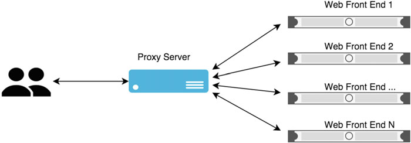
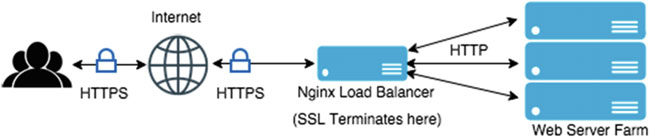

## Nginx

Nginx is a web server that can also be used as a reverse proxy, load balancer, mail proxy and HTTP cache. 

### Main Features

* At its core, you can consider Nginx to be an event-based reverse proxy server. A reverse proxy is a type of proxy server that retrieves resources from the servers on behalf of a client.
It can be helpful to offload the number of requests that the actual web server ends up handling.

* Modular Design: It has an extremely extensible architecture due to its support for plug-ins. Even basic things like SSL and
compression are built as modules. The real power lies in the fact that you can rebuild Nginx from source
and include or exclude the modules that you don’t need. This gives you a very focused executable that does
precisely what you need.

* Asynchronous Web Server: Nginx gains much of its performance due to its asynchronous and event-based architecture whereas Apache
and IIS like to spin new threads per connection, which are blocking in nature. Both IIS and Apache handle
the threads using multithreaded programming techniques . Nginx differs in the approach completely. It does
not create a separate thread for each request. Instead it relies on events.

* Reverse Proxy and Load Balancing Capability: Nginx analyzes the request based on its URI and decides how to proceed with the request. In other words,
it is not looking at the file system to decide what it has to do with it. Instead, it makes that decision based
on the URI. This differentiation enables Nginx to act as a very fast front end that acts as a reverse proxy and
helps balance the load on the application servers. It’s no exaggeration to say that Nginx is a reverse proxy first
and a web server later.
Nginx can also fit very well in a hybrid setup. So, the front-end job is taken care of by Nginx , and
everything else gets delegated to the back end (to Apache, for instance).

* Multiple Protocol Support: HTTP(S), WebSocket , IMAP , POP3 , SMTP: As a proxy server, Nginx can handle not only HTTP and HTTPS requests, but also mail protocols with equal
grace. There are modules available that you can use while compiling your build and Nginx will proxy your
mail-related traffic too.

* SSL Termination: Secure Sockets Layer is a necessity for any website that deals with sensitive data. And, just like any other
necessity, there is a cost involved. When it comes to web traffic, SSL also induces an extra processing
overhead on the server side where it has to decrypt the request every time. There lies a catch-22 situation: If
you remove the SSL, you are opening yourself up for attacks and if you use SSL, you end up losing a little bit
on speed (or additional cost due to scaling out)!
Since Nginx has the capability of acting as a load balancer, you can give it additional work as well.
Essentially, the idea of an SSL termination is that the request will come to the load balancer on
a secure channel but will be sent to the other web servers without SSL. This way, your web server acts faster
and eventually your requests go out to the clients in a secure manner as well.

